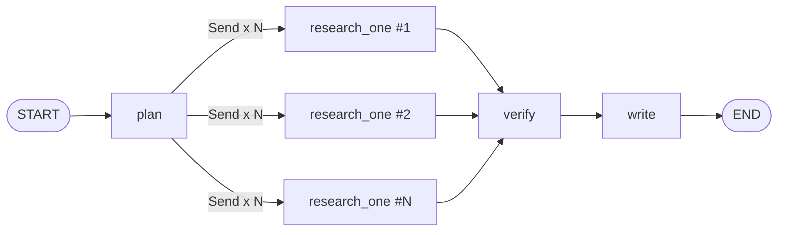

# Architecture

## Graph

- **plan** — decomposes the user's question into 2-4 independently
  searchable subquestions (`agents/planner.py`).
- **research_one** — one instance per subquestion, run concurrently via
  LangGraph's `Send` API. Each instance searches the web and extracts
  atomic, quoted claims, each tagged with the exact source URL it came
  from (`agents/researcher.py`).
- **verify** — runs once all research branches complete. Two passes:
  1. **Deterministic citation-integrity check** (no LLM call): a claim's
     URL must be one of the URLs that subquestion's search actually
     returned. Catches a model citing a source it never saw.
  2. **LLM cross-source check**: for each subquestion, the surviving
     claims are reviewed together so the model can catch claims that
     *contradict each other* (see the growth-trend example in
     `tests/conftest.py`), not just claims that look weak in isolation.
- **write** — turns only the claims marked `supported` into report prose.
  Everything else (`unsupported`, `contradicted`, `invalid_citation`) is
  listed verbatim in a "Limitations" section built without an LLM call,
  so it can't be softened by a generation quirk.

## Why LangGraph's `Send` API specifically

A plain `for subquestion in subquestions: research(subquestion)` loop
would work, but it serializes every search + extraction call. Fanning out
with `Send` lets `research_one` branches run concurrently (LangGraph
schedules them as parallel graph "supersteps" and waits for all of them
before `verify` runs), which is the actual reason this project reaches
for a graph library instead of a script. On a 3-subquestion run the
critical path improves from `~3x` a single research call to `~1x` (plus
the shared plan/verify/write overhead).

## Observability

Every node is wrapped in `tracing.RunTracer.step(...)`, which records
start/end time, latency, and token usage without any external APM
dependency. The FastAPI layer streams these as Server-Sent Events as they
happen (`api.py`), and the frontend renders them live plus a final
per-node trace table — so a user watching a run sees "planning...",
"researching subquestion 2 of 3...", "verifying...", "writing..." instead
of a blank spinner.

## Evaluation

`eval/run_eval.py` runs the entire graph over `eval/benchmark.jsonl` (8
open-ended research questions) and checks structural invariants:

- **Pipeline success rate** — every question completes without an
  exception and produces a schema-valid report.
- **Uncited-prose check** — the single most important invariant: a
  section with real prose must carry at least one citation, or be the
  honest "no verified information found" fallback. A section with
  neither is exactly the failure mode this project exists to prevent.
- **Citation coverage**, **source diversity**, **latency**, **token
  usage** per run.

`--mock` runs this fully offline (deterministic generic mocks in
`eval/mocks.py`), which is what CI runs on every push
(`.github/workflows/ci.yml`). `--live` runs the same benchmark against a
real Groq + Tavily key for a pre-release sanity check.
